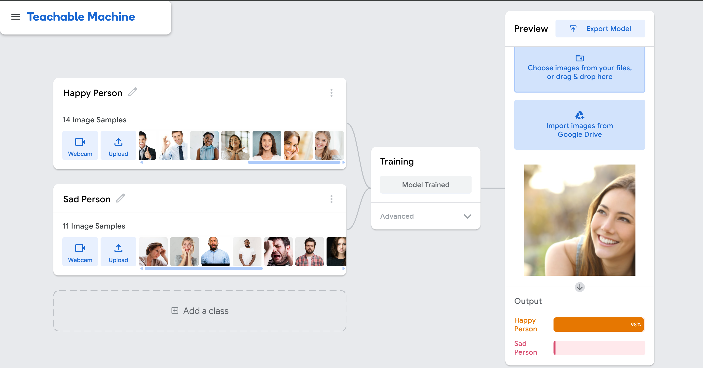

# Condition Classifier: Happy or Sad Detection using Teachable Machine

This project uses **Google's Teachable Machine** to classify whether a person appears **happy** or **sad** in a photo.

It uses a **custom-trained model** based on two classes:  
- 😊 **Happy Person**  
- 😢 **Sad Person**

The final application allows the user to upload a picture, and the model will predict the emotion class based on facial features.

---

## 🧠 How It Works

1. **Training the Model**
   - Used [Teachable Machine](https://teachablemachine.withgoogle.com/) Image Project.
   - Created **two classes**:
     - `Happy Person`
     - `Sad Person`
   - Collected training images for each emotion using a webcam or uploaded photos.
   - Trained the model in-browser using Teachable Machine’s built-in tools.

2. **Exporting the Model**
   - Exported the model as a **TensorFlow-Keras model**.

3. **Running the Prediction**
   - The web allows the user to **upload an image**.
   - The model analyzes the image and returns the prediction: **Happy** or **Sad**.
   - Displays the result with a confidence percentage.

---

## 🖼️ Example

| Uploaded Image | Prediction |
|----------------|------------|
|  | 😊 Happy Person |
|      | 😢 Sad Person   |

---

